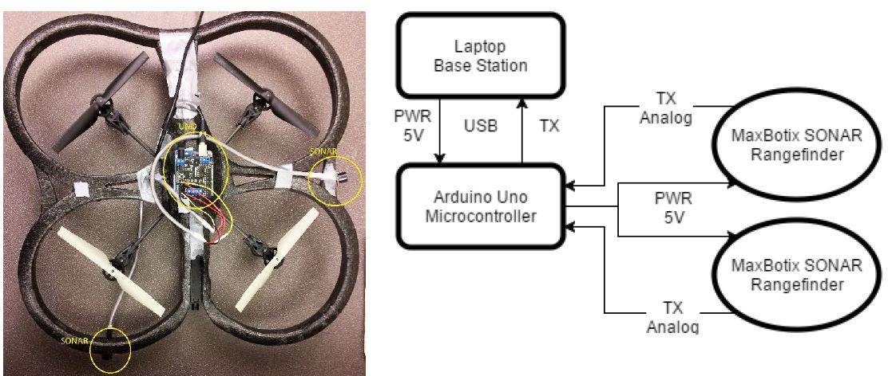
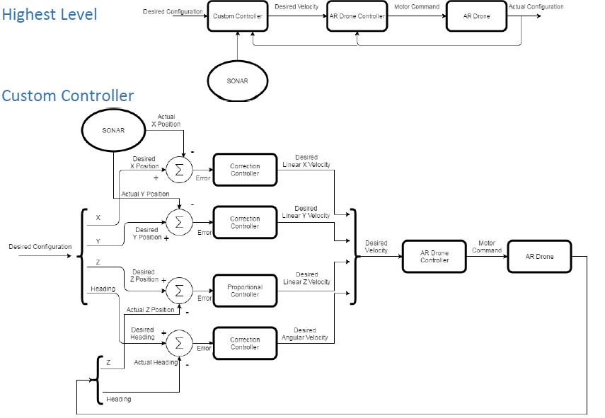
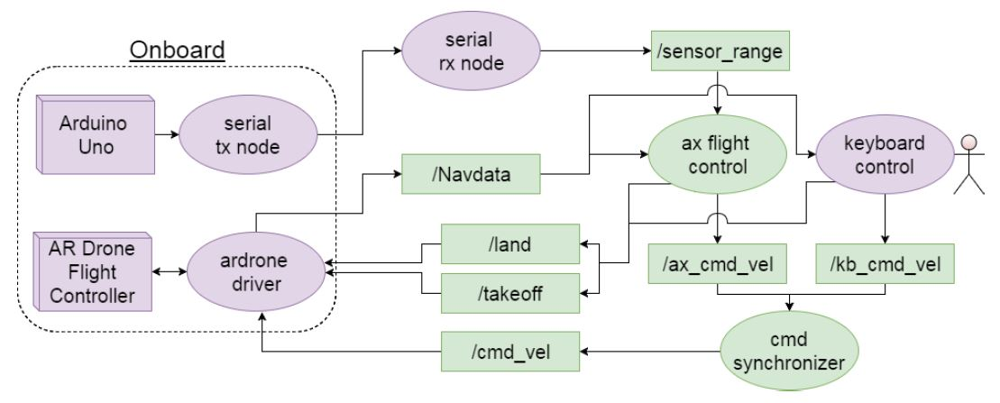
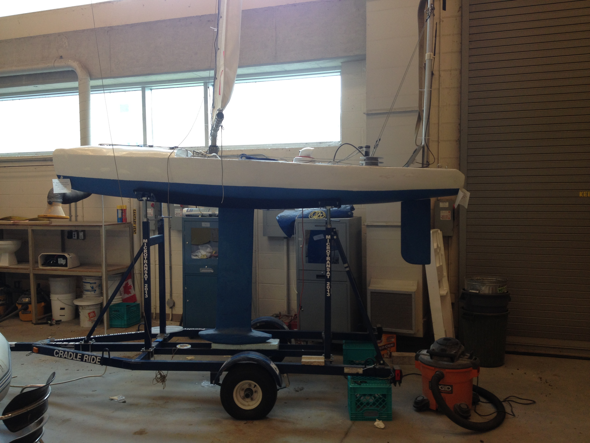
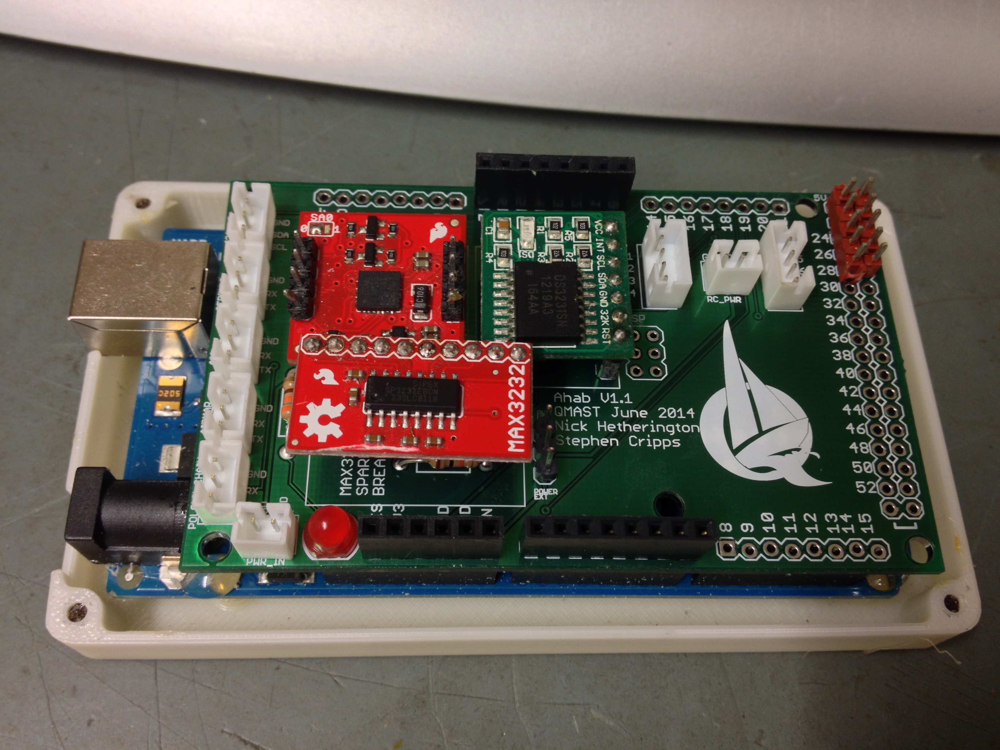

**Navigation**
* [Homepage](/README.md)
* [Portfolio](/md/portfolio.md)

# Undergraduate Projects

## UAV Indoor Guidance System
*4th Year Undergraduate Capstone Project* 
I co-designed and implemented a control system for a quadrotor UAV to follow walls and traverse corners. 
 
We augmented an off-the-shelf drone with SONAR sensors and an Arduino microcontroller: 
  
 
We designed a pose control system using a PI controller: 
  
 
We implemented the control system using ROS and Python: 
  
  
 
* [Video Demonstration](https://youtu.be/U2KSUFkIpCI)
* We placed 3rd at the 2017 IEEE Eastern Ontario Student Paper Competition (Ottawa, ON).

## Electrical Design Lead and Project Manager - Queen's Mostly Autonomous Sailboat Team
I was part of the Queen's Most Autonomous Sailboat Team (QMAST) for three years:
* In the summer of 2014 I did a co-op term as the Electrical Design Lead.
* In my third year (2014/2015) I was the Electrical Team co-manager as a volunteer extra-curricular.
* We placed 2nd at the 2015 International Robotic Sailing Regatta (St. John's NL).
 
 
*The mechanical team built a 2-metre long fixed keel, single sail boat.* 
 
 
*I designed and built the embedded electrical systems, including power, computing, and motor control systems.* 
 
 
*The battery management, power distribution, and motor control module.* 
 
 
*The computing module.* 
 
 
*I designed a number of custom PCBs throughout this project.* 
 

**Navigation**
* [Homepage](/README.md)
* [Portfolio](/md/portfolio.md)