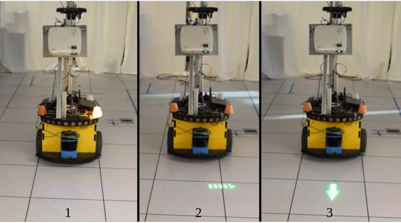
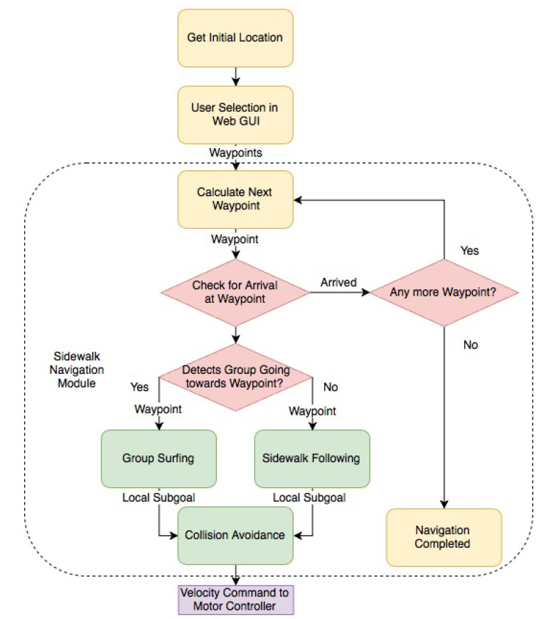
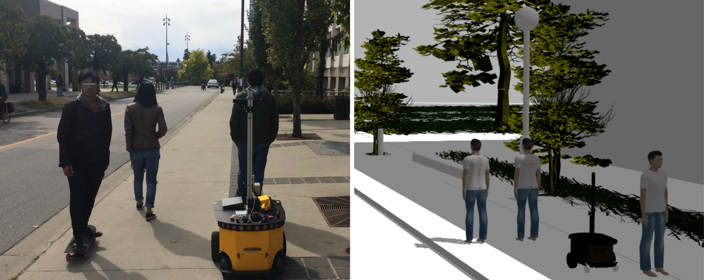
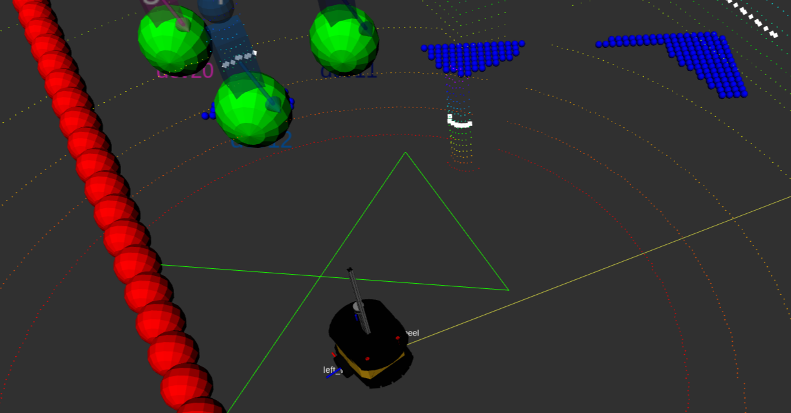
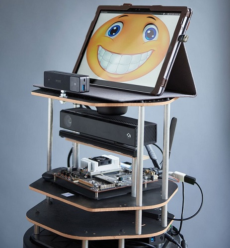
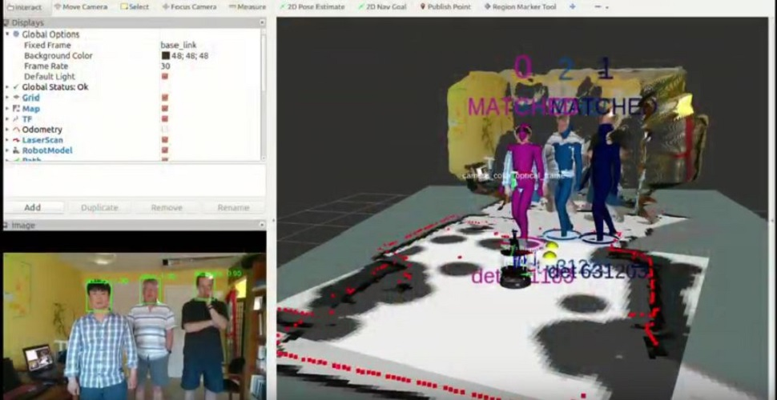

**Navigation**
* [Homepage](/README.md)
* [Portfolio](/md/portfolio.md)

# Mobile Robotics Research
I completed my Master of Applied Science (MASc) degree in the [Collaborative Autonomous Robotics and Intelligent Systems Laboratory](http://caris.mech.ubc.ca/) at [The University of British Columbia](https://www.ubc.ca/) in 2020.
My MASc is in Mechanical Engineering, but in practice my research was a mix of software engineering and user interaction design.
My thesis was: ["Design and Evaluation of Nonverbal Motion Cues for Human-Robot Spatial Interaction"](https://open.library.ubc.ca/cIRcle/collections/ubctheses/24/items/1.0394282) 

Below are the main projects to which I contributed during my degree. In each project I used the [Robot Operating System (ROS 1)](https://www.ros.org/) distributed middleware and programmed in either Python 2.7 or C++ 11.

## Robotic Motion Legibility Cues
  
My [thesis](https://open.library.ubc.ca/cIRcle/collections/ubctheses/24/items/1.0394282) research was on robot-to-human "motion legibility cues". I designed these cues for a mobile robot to communicate its intentions and forthcoming motion to pedestrians. 
See my [GitHub repository here](https://github.com/njhetherington/commbot) for details, images, and videos. 
One paper is under peer-review for publication.

## The "Group Surfing" Method for Mobile Robot Navigation Amongst Pedestrians
The Group Surfing method allows a mobile robot to navigate between sidewalk corners by following groups of pedestrians. We integrated an autonomous navigation system using the Group Surfing algorithm, multi-agent collision avoidance, and sidewalk following.
I worked on this research project in a team of 5 during the first summer of my Master's. We published a peer-reviewed paper at a top-tier IEEE robotics conference (see below). 

  
*Diagram of the robot's navigation system. I developed the collision avoidance system.* 
 

  
*We tested and demonstrated the system on sidewalks around the university (left). 
I created a simulation environment for development and evaluation of the Group Surfing algorithm (right).* 
 

  
*Screenshot of Rviz (ROS data visualization tool) showing the robot's collision avoidance system, which I created.* 
 

**Media:**
* [Y. Du, **N.J.Hetherington**, et al., "Group Surfing: A Pedestrian-Based Approach to Sidewalk Robot Navigation," 2019 International Conference on Robotics and Automation (ICRA), Montreal, QC, Canada, 2019, pp. 6518-6524, doi: 10.1109/ICRA.2019.8793608](/pdf/group_surfing/icra19_paper.pdf)
* [Conference Poster](/pdf/group_surfing/icra19_poster.pdf)
* [Video Demonstration 1](https://youtu.be/fy7fKOADg_A)
* [Video Demonstration 2](https://youtu.be/PHhtYIkdxiw)

**My contributions:**
* Co-developed the Group Surfing algorithm for mobile robot navigation amongst pedestrians.
* Adapted a pre-trained artificial neural network for multi-agent collision avoidance in a sidewalk environment (ROS/Python).
* Integrated the collision avoidance system into the ROS Navigation Stack (ROS/Python).
* Created simulation environments for system development and testing by integrating a crowd simulator ([PedSim](http://pedsim.silmaril.org/)) with a physical simulator ([Gazebo](http://gazebosim.org/)) (ROS/C++).
* Co-designed tests and performed statistical analysis to compare our method to others (R).
* Co-authored two papers and two posters.

## Identity-Specific Person Following by a Mobile Robot
The [3Spheres Robotics Project by JDQ Systems Inc.](https://3srp.com/about-the-robots/) is developing a social assistance robot, "Aether", for elder care homes. I worked on this project during a co-op as part of my Master's. My research lab had various partnerships with [JDQ Systems Inc.](https://www.jdq.com/). 

   
*The Aether robot (left). | Rviz screenshot showing Aether's identity-specific person following system (right).*

**Media:**
* [Video Demonstration](https://youtu.be/Siz9rVsqGW4)
* [November 2020 TechXplore Article](https://techxplore.com/news/2020-11-robot-track-specific-people.html)
* Paper under peer-review for publication.

**My contributions:**
* Programmed an interface between a microphone and the MS Azure Speaker Recognition API (ROS / Python).
* This interface helped the robot learn to recognize a person's voice (see video demonstration above).

# Mobile Robotics Projects Under My Supervision

## Mobile Robot Yielding Cues
During my Master's I closely supervised a 4th year Mechatronics student, Ryan Lee, while he was working on this project. We co-designed robot-to-human communication cues for a robot to use when yiedling to a pedestrian at a doorway. Ryan implemented the cues on the robot (ROS/C++) with my help. We conducted a user study to evaluate and compare the cues.  

 
*Images of the five robot-to-human yielding cues.* 

**Media:**
* [Videos used in online user study.](https://youtu.be/iE9S8QceWdY)
* Paper under peer-review for publication.

<!--Leader-Follower Robots -->

**Navigation**
* [Homepage](/README.md)
* [Portfolio](/md/portfolio.md)